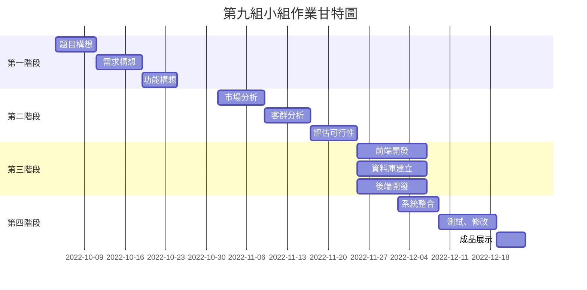

**小組作業1** : 
顯示在小組的github上，請列出專案的
- 組長與組員之姓名
- 個別組員的任務
- 專題題目
- 內容
- 甘特圖與PERT/CPM圖 (期限: A班 10/10 , B班10/11)

## 專案組別: 9

### 組員介紹與分工

|     第9組     |  姓名  |                   個別任務                   |
| :------------: | :----: | :------------------------------------------: |
| **組長** | 林澤權 | 題目構想、流程設計、功能構想、後端開發、測試 |
|      組員      | 潘沛儀 |    需求構想、市場調查、前端開發、企劃發想    |
|      組員      | 李翊翎 |    需求構想、市場調查、前端開發、企劃發想    |
|      組員      | 陳宥諺 |          資料庫設計、後端開發、測試          |
|      組員      | 林貞智 |         題目構想、功能構想、後端開發         |

### 專題題目

- 失蹤人口分析與找尋(暫定)
- 車輛拖吊分析與找尋

### 內容

1. 依據[國家人口失蹤資料集為來源](https://data.gov.tw/dataset/14420)，可以透過其資料集，分析年齡層、失蹤性別、地區比例等... 提供相關研究人員參考
2. 透過平台，可以依據失蹤地點、特徵、年齡、時間去篩選可能的人選

### 甘特圖

- mermaid繪製版本

### PERT/CPM圖

- google繪製版本

- mermaid繪製版本

[PERT圖繪製版本連結](https://hackmd.io/@cjqBX7RDSMSJUP0adJLUmw/rkDcmRbmj)

