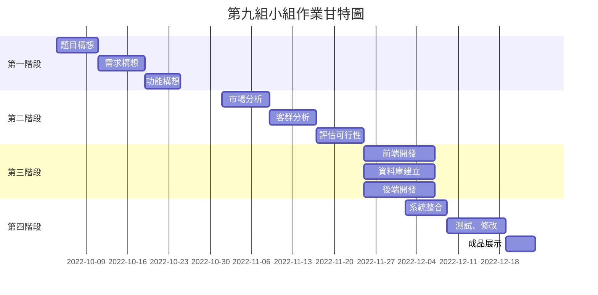

小組作業 1: 顯示在小組的github 上，請列出專案的組長與組員之姓名，個別組員的任務，專題題目，內容，甘特圖與PERT/CPM圖 (期限: A班 10/10 , B班10/11)

## 專案組別: 9

### 組員介紹與分工

|     第9組     |  姓名  |                   個別任務                   |
| :------------: | :----: | :------------------------------------------: |
| **組長** | 林澤權 | 題目構想、流程設計、功能構想、後端開發、測試 |
|      組員      | 潘沛儀 |    需求構想、市場調查、前端開發、企劃發想    |
|      組員      | 李翊翎 |    需求構想、市場調查、前端開發、企劃發想    |
|      組員      | 陳宥諺 |          資料庫設計、後端開發、測試          |
|      組員      | 林貞智 |         題目構想、功能構想、後端開發         |

### 專題題目

- 失蹤人口分析與找尋(暫定)
- 車輛拖吊分析與找尋

### 內容

1. 依據國家人口失蹤資料集為來源，可以透過其資料集，分析年齡層、失蹤性別、地區比例等... 提供相關研究人員參考
2. 透過平台，可以依據失蹤地點、特徵、年齡、時間去篩選可能的人選

### 甘特圖

### Mermaid



### PERT/CPM圖

```graphviz
digraph {
	node[shape=record];
	rankdir="LR";
    no1 [label = "題目構想| 編號:1 | 開始:第1天 | 結束:第10天 | 需時:7天"]
    no2 [label = "需求構想|開始: 第9天  |編號: 2|結束: 第17天 | 需時:8天|
"]
    no3 [label = "功能構想 |開始: 第18天 | 編號: 3| 結束: 第28天  |需時:10天"]
    no1->no2
    no2->no3
    
    no4 [label = "市場分析|開始: 第29天  |編號: 4|結束: 第37天  |需時:8天
"]
    no5 [label = 客群分析|開始: 第29天  |編號: 5|結束: 第37天  |需時:8天
"]  
    no3->no4
    no3->no5
    no6 [評估可行性 | label = 開始: 第38天  |編號: 6|結束: 第46天  |需時:8天"]  
    no4->no6
    no5->no6
    no7 [label = 前端開發|開始: 第47天|編號:7|結束: 第59天|需時:12天"]  
    no8 [label = 資料庫建立|開始: 第47天|編號:8|結束:第59天|需時:12天"]  
    no9 [label = 後端開發|開始: 第47天|編號:9|結束: 第59天  |需時:12天"]     no6->no7
    no6->no8
    no6->no9
    no10 [label =系統整合|開始: 第60天|編號:10|結束: 第67天 |需時:7天"]
    no7->no19
    no8->no10
    no9->no10
    no11 [label =測試、修改|開始: 第68天|編號: 11|結束: 第78天|需時:10天
"]
    no12 [label =成品展示|開始: 第79天|編號: 12|結束: 第84天|需時:5天"]
    no10->no11
    no11->no12

}
   
```
