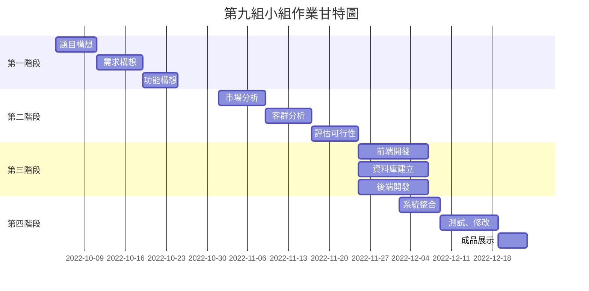
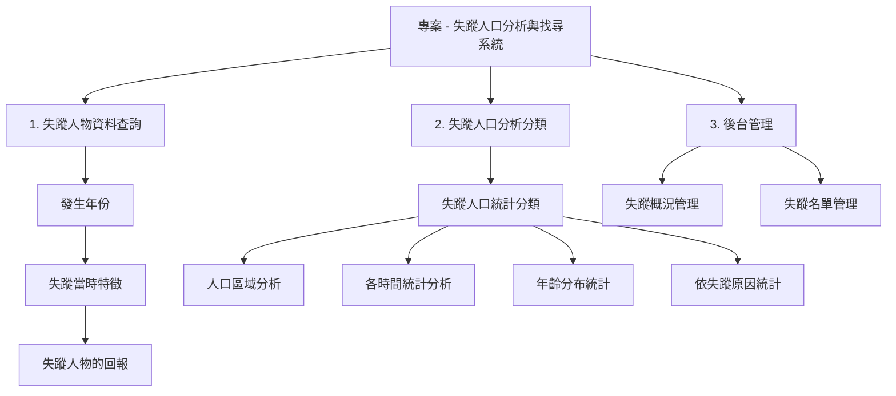

**小組作業1** : 
顯示在小組的github上，請列出專案的
- 組長與組員之姓名
- 個別組員的任務
- 專題題目
- 內容
- 甘特圖與PERT/CPM圖 (期限: A班 10/10 , B班10/11)

## 專案組別: 9

### 組員介紹與分工

|     第9組     |  姓名  |                   個別任務                   |
| :------------: | :----: | :------------------------------------------: |
| **組長** | 林澤權 | 題目構想、流程設計、功能構想、後端開發、測試 |
|      組員      | 潘沛儀 |    需求構想、市場調查、前端開發、企劃發想    |
|      組員      | 李翊翎 |    需求構想、市場調查、前端開發、企劃發想    |
|      組員      | 陳宥諺 |          資料庫設計、後端開發、測試          |
|      組員      | 林貞智 |         題目構想、功能構想、後端開發         |

## week4小組作業1 : 

### 專題題目

- 失蹤人口分析與找尋(暫定)
- 車輛拖吊分析與找尋

### 內容

1. 依據[國家人口失蹤資料集為來源](https://data.gov.tw/dataset/14420)，可以透過其資料集，分析年齡層、失蹤性別、地區比例等... 提供相關研究人員參考
2. 透過平台，可以依據失蹤地點、特徵、年齡、時間去篩選可能的人選

### 甘特圖

- mermaid繪製版本

### PERT/CPM圖

- google繪製版本

- mermaid繪製版本

[PERT圖繪製版本連結](https://hackmd.io/@cjqBX7RDSMSJUP0adJLUmw/rkDcmRbmj)

## week6小組作業2: 

### 功能性需求與非功能性需求

- **功能性需求**
    1. 失蹤人物資料查詢
    2. 男女性失蹤比例分析
    3. 失蹤人口地區分析
    4. 失蹤人口特徵分類
    5. 各月失蹤統計分析

- **非功能性需求**
    1. 反應性: 24小時提供使用者查詢資料並且快速查詢
    2. 使用性: UI介面清楚、功能簡約明瞭
    3. 可靠度: 資料可自動備份、自訂系統資料排序方式
    4. 效能: 2秒內至少能夠載入100筆資料
    5. 維護性: 資料集能夠即時同步更新
    
### 呈現功能分解圖(functional decomposition diagram, FDD)

### 寫出需求分析的文字描述(髓機抽三個人寫)

**一個人口失蹤分析與查詢的網站的需求分析如下:**
- **管理者**
    - 可以依據失蹤對象的資訊去分類
    - 可以針對使用者失蹤對象的對照找到該對象
    - 更新失蹤人口名單資料

- **使用者**
    - 可以依據對象失蹤的發生時間及特徵去做查詢
    - 可以選擇統計圖的呈現樣式
    - 可以依據失蹤對象進行類別篩選
    - 篩選類別可以為時間、地區、原因等
    - 使用者回報網站失蹤對象詳細資訊
- 
### 劃出三個以上的使用案例說明及使用案例圖(隨機抽三個人寫)

**查詢系統**

1.使用案例圖:

2.使用案例說明:

| 使用案例名稱 | 失蹤人口查尋及通報 |
| --- | --- |
| 行動者 | 使用者 |
| 說明 | 依據所需條件查詢失蹤對象 |
| 完成動作 | 1. 選擇發生時間 2.選擇地點 3. 說明特徵 4. 提交表單 5. 顯示查詢結果 6.選擇是否通報失蹤對象的資訊及情況 |
| 替代方法 | 1. 選擇發生時間 2.選擇地點 3. 說明特徵 4. 提交表單 5. 查無結果，選擇通報失蹤 |
| 先決條件 | 失蹤時間跟地點至少選擇一項 |
| 後置條件 | 確認條件後送出並依照資訊查詢結果，並選擇是否通報失蹤對象的資訊及情況 |
| 假設 |  |

**分析系統**

1.使用案例圖:

2.使用案例說明:

| 使用案例名稱 | 失蹤人口分析 |
| --- | --- |
| 行動者 | 使用者 |
| 說明 | 依據失蹤人口的條件及選擇呈現方式去顯示該條件的數據 |
| 完成動作 | 1. 選擇條件(性別、年齡、區域、發生時間、查獲情況) 2. 選擇呈現方式(文字雲、多項統計圖) 3. 依據選擇條件顯示結果 |
| 替代方法 | 1. 選擇條件(性別、年齡、區域、發生時間、查獲情況) 2. 選擇呈現方式(文字雲、多項統計圖) 3. 回傳資料有誤 |
| 先決條件 | 條件至少選擇一項，並必須選擇呈現方式 |
| 後置條件 | 條件及呈現方式都選擇後，即可回傳結果 |
| 假設 | 無 |

**管理系統**

1.使用案例圖:

2.使用案例說明:

| 使用案例名稱 | 維護系統後台管理 |
| --- | --- |
| 行動者 | 管理者 |
| 說明 | 管理者可依據失蹤概況管理，並管理失蹤人口的名單及目前情形，依據失蹤名單比對是否跟使用者通報相同 |
| 完成動作 | 1.依據失蹤概況管理
2.確認失蹤人口是否已找到
3.依據失蹤名單管理
4.確認名單內容與使用者回報相同 |
| 替代方法 | 1.依據失蹤概況管理
2.確認失蹤人口是否已找到
3.失蹤人口資料不符，通報回傳錯誤資料
4.依據失蹤名單管理
5.確認名單內容與使用者回報相同
6.失蹤人口資料不符，通報回傳錯誤資料 |
| 先決條件 |  |
| 後置條件 |  |
| 假設 |  |

### 使用Figma劃出第一個使用案例的動態模擬畫面

