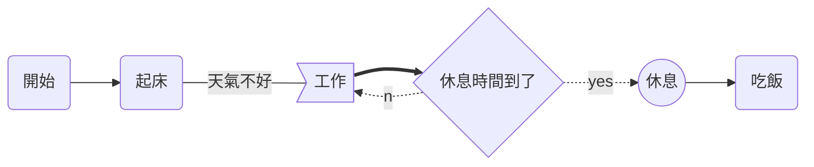

# 111-1-system-analysis-09

|第9組|姓名|個別任務|
|:----:|:----:|:----:|
|**組長**|林澤權|
|組員|潘沛儀|
|組員|李翊翎|
|組員|陳宥諺|
|組員|林貞智|

- 專題題目
- 內容
- 
---

- 甘特圖

```mermaid
graph LR
    A(開始) -->B(起床)
    B --天氣不好--- C>工作]
    C ==> D{休息時間到了}
    D -.yes.-> E((休息))
    D -.no.-> C
    E --> F(吃飯)
```

---

- PERT/CPM圖
